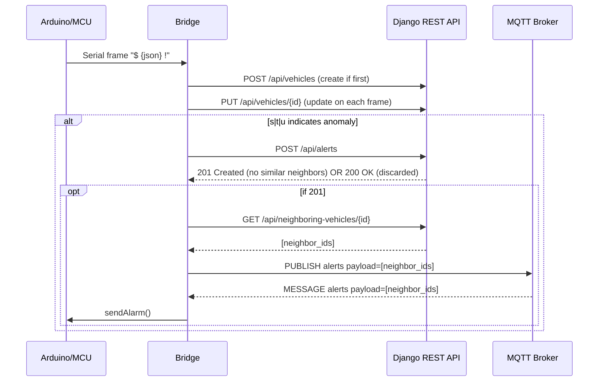
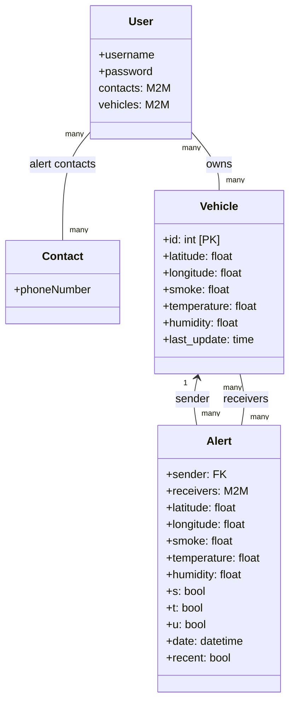

# AutoGuardian

Reliable, modular IoT platform for vehicle telemetry, anomaly detection, and neighbor-aware alerting.

A production-friendly stack with:
- A Python Bridge connecting an Arduino/MCU over Serial, pushing telemetry to a Django REST API, and broadcasting alerts via MQTT.
- A Django WebServer exposing REST endpoints and a simple web UI, backed by SQLite for development.
- A lightweight MQTT broker for near-real-time alert fan-out.

---

## Table of contents
- [Repository structure](#repository-structure)
- [High-level architecture](#high-level-architecture)
- [End-to-end sequence](#end-to-end-sequence-alert-path)
- [Components](#components)
  - [Bridge (Python)](#bridge-python)
  - [WebServer (Django)](#webserver-django)
  - [MQTT Broker](#mqtt-broker)
- [Features](#features)
- [Supported platforms](#supported-platforms)
- [Getting started](#getting-started)
- [REST API quick reference](#rest-api-quick-reference)
- [Configuration summary](#configuration-summary)
- [Production notes](#production-notes)
- [Troubleshooting](#troubleshooting)
- [Known issues](#known-issues)
- [Roadmap](#roadmap)
- [Contributing](#contributing)
- [License](#license)
- [Acknowledgements](#acknowledgements)

---

## Repository structure

```text
AutoGuardian/
  Bridge/                # Serial↔REST↔MQTT "bridge" service
    API/                 # HTTP client wrappers and dataclasses
    MQTT_client/         # MQTT client wrapper (paho-mqtt)
    bridge.py            # Core loop: Serial parsing, API calls, alert logic
    main.py              # Bridge entrypoint
    config.ini           # Bridge configuration (Serial, REST, MQTT)
    requirements.txt
  WebServer/             # Django project (REST API + simple WebSite)
    REST/                # Models, serializers, views, urls for the API
    WebServer/           # Django project settings/urls
    WebSite/             # Basic server-rendered pages and static assets
    manage.py
    requirements.txt
    scripts.py           # Utility script to seed users/vehicles
  MQTT_Broker/           # Mosquitto configuration
    mqtt.conf
  README.md              # This file
```

## High-level architecture

```mermaid
flowchart LR
  MCU[(Arduino/MCU)] -- "$ ... JSON ... !" --> BR[Bridge (Python)]
  BR -- "POST /api/vehicles, PUT /api/vehicles/{id}" --> API[Django REST API]
  API -- ORM --> DB[(SQLite)]
  BR -- "POST /api/alerts" --> API
  API -- "neighbor calc, 201 if created; 200 if discarded" --> BR
  BR -- "GET /api/neighboring-vehicles/{id}" --> API
  BR -- "PUBLISH [ids]" --> MQ[(MQTT Broker)]
  MQ -- "alerts topic" --> BR
  BR -- "sendAlarm() over Serial" --> MCU
  subgraph WebServer
    API
    DB
  end
```

## End-to-end sequence (alert path)



## Components

### Bridge (Python)
- Reads framed Serial data: `$` marks start and `!` marks end; payload is JSON.
- On first packet for a given vehicle, creates the vehicle in the API; then updates it on subsequent packets.
- If any of `s`, `t`, or `u` flags is `1` (alert conditions), it posts an alert to the API.
- When the API accepts an alert (HTTP 201), it fetches neighboring vehicle IDs and publishes them on the MQTT `alerts` topic; any Bridge instance receiving a list containing its local `ID` triggers `sendAlarm()` to the MCU.

Key files:
- `Bridge/bridge.py`: main loop, Serial parsing, alert logic, neighbor discovery, MQTT publish/subscribe.
- `Bridge/MQTT_client/client.py`: MQTT wrapper using `paho-mqtt`.
- `Bridge/API/api.py`: typed clients for Vehicles, Alerts, Neighboring Vehicles endpoints.
- `Bridge/config.ini`: config for Serial, REST target and MQTT.

Expected JSON payload from MCU (inside `$ ... !`):
```json
{
  "id": 1,
  "latitude": 44.6471,
  "longitude": 10.9252,
  "smoke": 0.0,
  "temperature": 25.0,
  "humidity": 40.0,
  "s": 0,
  "t": 0,
  "u": 0
}
```

Note: `Bridge` has a local node identifier `ID` (default `1`) used to decide whether to react to MQTT alerts.

### WebServer (Django)
- Exposes REST endpoints under `/api/` for vehicles, alerts, contacts, and neighbor discovery.
- Persists data in SQLite (dev) and serves a lightweight `WebSite/` UI.
- Timezone defaults to `Europe/Rome`, language `it-it` (adjustable in `WebServer/WebServer/settings.py`).

Core REST models (`WebServer/REST/models.py`):


Key endpoints (`WebServer/REST/urls.py`):
- `GET /api/vehicles/`: list vehicles
- `POST /api/vehicles/`: create vehicle
- `GET /api/vehicles/{id}/`: retrieve vehicle
- `PUT /api/vehicles/{id}/`: update vehicle
- `DELETE /api/vehicles/{id}/`: delete vehicle
- `GET /api/alerts/`: list alerts
- `POST /api/alerts/`: create alert; API discards (200) if neighboring vehicles show similar values, otherwise creates (201)
- `GET /api/contacts/{vehicle_id}`: owner’s contact phone numbers
- `GET /api/neighboring-vehicles/{vehicle_id}/`: IDs of vehicles within a radius (default 5 km)

Utility script:
- `WebServer/scripts.py` seeds three users and one vehicle each; optionally generates sample alerts.

### MQTT Broker
A standard Mosquitto broker. Sample config in `MQTT_Broker/mqtt.conf`:
```conf
listener 1883
allow_anonymous true
```
Topic used by Bridge: `alerts` (configurable).

## Features
- Framed Serial ingestion with robust packet boundaries (`$`/`!`).
- REST-first design with explicit models/serializers and clean separation of concerns.
- Neighbor-aware alerting: suppresses false positives by comparing nearby vehicles.
- MQTT fan-out for low-latency dissemination of alerts to neighboring nodes.
- Simple web UI and REST quick reference for testing.

## Supported platforms
- Bridge: Windows, Linux, macOS (requires correct Serial port and `paho-mqtt`).
- WebServer: any OS with Python 3.10+.
- MQTT Broker: Mosquitto on Windows/Linux/macOS.

## Getting started

### Prerequisites
- Python 3.10+
- pip (and optionally `venv`)
- Mosquitto MQTT broker (Windows/macOS/Linux)
- Arduino/MCU connected via Serial (or a simulator that emits framed JSON)

### 1) Start the WebServer (Django)
```bash
cd WebServer
python -m venv .venv
# Windows PowerShell
. .venv\Scripts\Activate.ps1
pip install -r requirements.txt
python manage.py migrate
# Run on 0.0.0.0:8080 to match Bridge config
python manage.py runserver 0.0.0.0:8080
```
Optional: seed users and vehicles
```bash
python manage.py shell -c "from scripts import script; script()"
```

### 2) Start the MQTT broker (Mosquitto)
- Install Mosquitto.
- From the repository root:
```bash
# Windows example (adjust path to mosquitto.exe if needed)
mosquitto -v -c MQTT_Broker\mqtt.conf
```
Broker defaults: `localhost:1883`, anonymous allowed (dev only).

### 3) Configure and run the Bridge
Edit `Bridge/config.ini` to match your environment:
```ini
[SERIAL]
PORTNAME = COM3                 ; Windows example (use your COM port)

[SERVERCONFIG]
HOST = 127.0.0.1               ; or your LAN IP
PORT = 8080
VEHICLES_ENDPOINT = api/vehicles/
ALERTS_ENDPOINT = api/alerts/

[MQTT]
Server = 127.0.0.1
Port = 1883
Topic = alerts
```
Install dependencies and run:
```bash
cd Bridge
python -m venv .venv
. .venv\Scripts\Activate.ps1   # Windows PowerShell
pip install -r requirements.txt
python main.py
```
If the Serial port cannot be opened, the Bridge prints available ports to help you pick the correct `PORTNAME`.

## REST API quick reference

Vehicles
```bash
# List vehicles
curl -s http://<HOST>:8080/api/vehicles/

# Get vehicle by ID
curl -s http://<HOST>:8080/api/vehicles/1/

# Create vehicle
curl -s -X POST -H "Content-Type: application/json" \
  -d '{"id":1,"latitude":44.64,"longitude":10.92,"smoke":0,"temperature":25,"humidity":40}' \
  http://<HOST>:8080/api/vehicles/

# Update vehicle
curl -s -X PUT -H "Content-Type: application/json" \
  -d '{"id":1,"latitude":44.65,"longitude":10.90,"smoke":0,"temperature":26,"humidity":41}' \
  http://<HOST>:8080/api/vehicles/1/
```

Alerts
```bash
# Create alert (flags s,t,u indicate conditions)
curl -s -X POST -H "Content-Type: application/json" \
  -d '{"sender":1,"latitude":44.64,"longitude":10.92,"smoke":0,"temperature":25,"humidity":40,"s":1,"t":0,"u":0}' \
  http://<HOST>:8080/api/alerts/
```

Neighbor discovery
```bash
curl -s http://<HOST>:8080/api/neighboring-vehicles/1/
```

## Configuration summary
- `Bridge/config.ini`
  - `[SERIAL] PORTNAME`: Serial port for MCU (e.g., `COM3`, `/dev/ttyUSB0`).
  - `[SERVERCONFIG] HOST, PORT`: Django server address (default `127.0.0.1:8080`).
  - `[SERVERCONFIG] VEHICLES_ENDPOINT, ALERTS_ENDPOINT`: API paths.
  - `[MQTT] Server, Port, Topic`: MQTT broker and topic (default `alerts`).
- `WebServer/WebServer/settings.py`
  - SQLite DB, `DEBUG=True`, `ALLOWED_HOSTS=['*']` for development.
  - Timezone `Europe/Rome`, language `it-it`.

## Production notes
- Replace SQLite with PostgreSQL or MySQL in `DATABASES`.
- Set `DEBUG=False`, configure `ALLOWED_HOSTS`, HTTPS, and a strong `SECRET_KEY` via environment variables.
- Run Django under `gunicorn`/`uvicorn` behind Nginx; use a process manager (systemd/supervisor).
- Use authenticated MQTT and TLS where possible; disable `allow_anonymous` in production.
- Secure Serial interfaces and validate MCU payloads; consider signing or sequence checks.

## Troubleshooting
- Serial: if connection fails, check `PORTNAME` and cabling; the Bridge prints available ports on failure.
- Ports: ensure `runserver` uses `:8080` to match `config.ini`.
- MQTT: confirm the broker is reachable at `host:1883`; test with `mosquitto_sub -t alerts -v`.
- Firewall: on Windows, allow `python.exe` and `mosquitto.exe` through the firewall for local/LAN access.
- Data shape: MCU JSON must include `id, latitude, longitude, smoke, temperature, humidity, s, t, u`.

## Known issues
- `Bridge/MQTT_client/client.py` reads the topic from key `Topicc` (double “c”). Ensure your `config.ini` uses `Topicc = alerts`, or adjust the code/key to `Topic` for consistency.

## Roadmap
- Dockerized local stack (Django, Mosquitto, Bridge simulator).
- AuthN/Z for REST endpoints and broker.
- Historical data storage and analytics dashboard.
- CI for tests and linting.

## Contributing
- Fork the repository, create a feature branch, and submit a pull request.
- Keep code readable and cohesive; include tests where applicable.

## License
Consider adding a license file if you plan to distribute this project.

## Acknowledgements
- Built with Django REST Framework and paho-mqtt.
- Geospatial distance by `geopy`.
